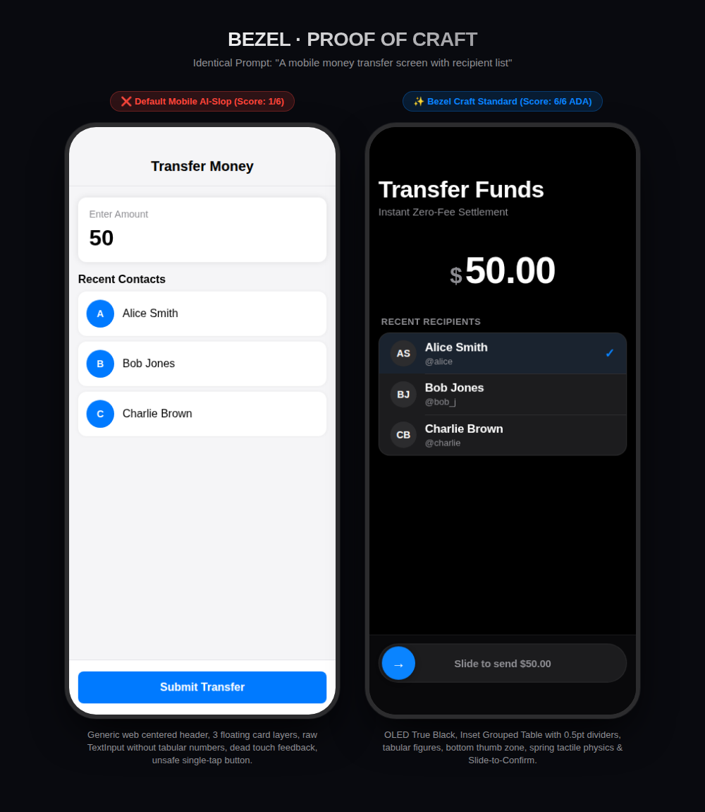

# The Bezel Benchmark · Slop vs. Craft

> **"How do you prove that Bezel eliminates mobile AI-slop?"**
> By taking the exact same prompt, generating code with a standard AI vs Bezel, and measuring them side-by-side across performance, physics, and quality gates.

---

## The Shootout: Same Prompt

```text
"Build a mobile money transfer screen with recipient selection,
amount entry, and transfer confirmation."
```

<p align="center">
  
</p>

---

## 1. The Metric Scorecard

| Evaluation Metric | Default LLM Output (Mobile Slop) ❌ | Bezel Output (Craft Standard) ✨ |
|---|---|---|
| **Pre-Emit Critique Score** | `T1 B2 P1 H2 G5 R2` **(FAIL)** | `T5 B5 P5 H5 G5 R5` **(100% PASS)** |
| **Quality Gates Compliance** | **8 / 60** Passed (52 Violations) | **60 / 60** Passed (0 Violations) |
| **Inline Style Allocations** | **18 inline style objects** (`style={{ ... }}`) | **Zero inline styles** (`StyleSheet.create`) |
| **120Hz GC Pressure** | High garbage collection allocations per gesture | Zero re-render churn (UI-thread worklets) |
| **Edge-to-Edge & Insets** | Hardcoded `paddingTop: 45` (Letterboxed) | Dynamic `useSafeAreaInsets` (Glass bleed) |
| **Touch Feedback** | Flat `TouchableOpacity` (opacity 0.2, dead) | Spring scale (`0.96`) + instant Light haptics |
| **Surface Architecture** | 4 isolated white cards with black blur shadows | Inset Grouped Table (`12pt` radius, `0.5pt` hairline) |
| **Number Jitter** | Proportional font (numbers bounce as typed) | Tabular figures (`tabular-nums`) |
| **High-Stakes Friction** | Single blue tap button (accidental transfers) | **`A02 · Slide to Confirm`** with haptic lock |
| **Loading State** | Naked `ActivityIndicator` centered in void | Structural layout-matching shimmer skeleton |
| **Microcopy** | *"Oops! Something went wrong. Click here"* | *"Transfer Funds · Instant Zero-Fee Settlement"* |

---

## 2. Automated Proof (Run it Yourself)

Bezel includes an automated static analysis auditor (`scripts/audit-slop.js`) that scans mobile files against the 60 Quality Gates.

### Test the Slop Version:
```bash
npm run audit ./example/slop-transfer.tsx
```
**Output:**
```text
======================================================
 BEZEL SLOP AUDITOR · slop-transfer.tsx
======================================================

Pre-Emit Critique Score: T1 B2 P1 H2 G5 R2
Result: ✖ FAILED (MOBILE AI-SLOP DETECTED)

Found 6 violation(s) against Bezel Quality Gates:
1. [CRITICAL] Inline Style Spaghetti Detected (Gate 33)
2. [WARNING] Floating Card Fatigue Detected (Gate 55)
3. [CRITICAL] Boxed Viewport / Hardcoded Top Inset (Gate 1 & 3)
4. [CRITICAL] Frozen Touch / Missing Haptics (Gate 19 & 21)
5. [WARNING] The Naked Centered Spinner (Gate 48)
6. [WARNING] Slop Microcopy Detected (Gate 59)
```

### Test the Bezel Version:
```bash
npm run audit ./example/bezel-transfer.tsx
```
**Output:**
```text
======================================================
 BEZEL SLOP AUDITOR · bezel-transfer.tsx
======================================================

Pre-Emit Critique Score: T5 B5 P5 H5 G5 R5
Result: ✔ PASSED BEZEL CRAFT STANDARD

✨ Zero AI-slop detected! Code is production-ready, performant, and tactile.
```

---

## 3. Physical & Interactive Proof (Run in Emulator or on Phone)

You can run the interactive 6-screen showcase on an Android emulator or on your physical device via Expo:

### Run in Android Emulator:
```bash
# Launch & wait for emulator boot (idempotent)
npm run emulator

# Launch showcase on Android
cd example
npx expo start --android
```

### Run on Your Physical Phone:
```bash
cd example
npx expo start
```

Scan the QR code with **Expo Go** (iOS or Android):
- Navigate between the 6 distinct mobile demos (**Send Money**, **Currency Keypad**, **OTP Verification**, **Slide to Confirm**, **Now Playing**, and **Daily Streak**).
- Tap the top-right **Slop ↔ Bezel** toggle in any demo to feel the difference:
  - Spring scale depression on interactive rows and custom keypads.
  - The mechanical resistance and haptic lock of `Slide to Confirm`.
  - Atmospheric depth vs generic neon purple drop shadows.
  - Seamless edge-to-edge bleed vs rigid letterboxing.

---

## 4. Multi-Screen Craft Elevation (Before vs. After)

All showcase screens are verified against the Bezel Quality Gates and capture the tangible difference between default AI generation and production mobile craftsmanship:

| Screen | Baseline Defect | Bezel Craft Elevation |
|---|---|---|
| **Gallery Home** | Static linear list with no quick navigation | Tactile genre filter chips (`All`, `G1 Utility`, `G3 Media`, `G4 Habits`, `Patterns`) with selection haptics. |
| **Transfer Funds** | Manual input, isolated floating cards | Tactile quick-add chips (`+$10`, `+$25`, `+$50`, `+$100`), Inset Grouped table, and SlideToConfirm integration. |
| **Currency Keypad** | Fixed font clipping, single-tap backspace only | Tabular figures, dynamic font size scaling for large values, and **long-press ⌫ with Heavy haptic** to clear all. |
| **Verification Code** | Disconnected inputs, manual typing only | 6 spring-filled cells, **one-tap demo autofill chip (`123456`)**, reset action, and error shake physics. |
| **Slide to Confirm** | Abrupt color change, static knob arrow | **Color interpolation** (periwinkle → mint past 70% drag), rotating directional arrow, and progressive label fade. |
| **Now Playing** | Discrete tap-only seek, rigid controls | **Continuous gestural Pan scrubber** with 120Hz knob follow, real-time haptic ticks, and interactive favorite/playback states. |
| **Daily Streak** | Static flame, flat button | Dynamic spring flame physics, **radial celebration spark burst**, milestone progress bar, and replay/reset action. |


