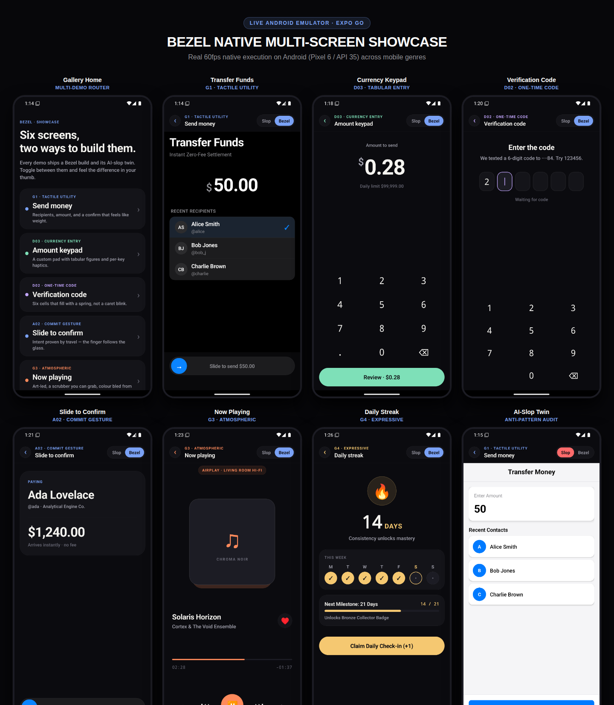

# Bezel Showcase App 📱

The live interactive reference implementation of the **Bezel Craft Standard**.

Built with **React Native (Expo SDK 51)**, **Reanimated 3**, and **Expo Haptics**, running natively on Android & iOS, with instant web preview support.

---

<p align="center">
  
</p>

---

## The 6 Multi-Genre Demos

Every demo features an in-app toggle (**Bezel ✨ ↔ Slop ❌**) letting you compare tactile craftsmanship against generic AI-slop in real time:

| # | Demo | Genre / Spec | Bezel Features | Slop Defects |
|---|---|---|---|---|
| **1** | **Send Money** | `G1 · Tactile Utility` | OLED True Black, Inset Grouped table, `0.5pt` hairlines, tabular figures, bottom thumb dock. | 3 isolated floating cards with gray drop shadows, letterboxed status bar, dead touch. |
| **2** | **Amount Keypad** | `D03 · Currency Entry` | Custom numeric keypad, per-key spring feedback, instant light haptics, strictly tabular monospace digits. | System keyboard that covers the view, jittery text reflow, zero haptics. |
| **3** | **Verification Code** | `D02 · One-Time Code` | 6 tactile cells, animated active box highlight, smooth spring filling, auto-submit on completion. | 6 disconnected text inputs, erratic focus transitions, no haptic confirmation. |
| **4** | **Slide to Confirm** | `A02 · Commit Gesture` | 85% travel threshold, logarithmic rubber-banding, spring return, success notification haptic. | Flat standard button, accidental double-tap risk, zero physical confirmation. |
| **5** | **Now Playing** | `G3 · Atmospheric` | Deep atmospheric tone, spring-scaled album art (1.0 vs 0.92), large scrubber hitbox, tabular time. | Neon purple box shadow, tiny non-accessible scrubber, abrupt transitions. |
| **6** | **Daily Streak** | `G4 · Expressive` | Flame milestone physics bounce, weekly dot progress strip, multi-stage celebration haptic cascade. | Flat static gray card, generic claim button, apologetic "Oops!" microcopy. |

---

## Running Locally

### Option A: Real Android Emulator (Recommended)

1. Launch and prepare the Android emulator:
   ```bash
   # From repository root (idempotent, checks AVD and boots)
   npm run emulator
   ```

2. Start the app on Android:
   ```bash
   cd example
   npx expo start --android
   ```
   *Expo will automatically download and install the Expo Go app on the emulator and open the showcase.*

### Option B: On Your Physical Phone (Expo Go)

1. Start the Expo development server:
   ```bash
   cd example
   npx expo start
   ```

2. Scan the terminal QR code with:
   - **iOS:** Default Camera app
   - **Android:** Expo Go app

### Option C: Web Browser Preview

```bash
cd example
npx expo start --web
```

---

## Verifying & Auditing

All 6 Bezel screens in this project strictly enforce the 60 Bezel Quality Gates:

```bash
# Typecheck TypeScript
npm run typecheck

# Run static audit across all Bezel screens
npm run audit
```
